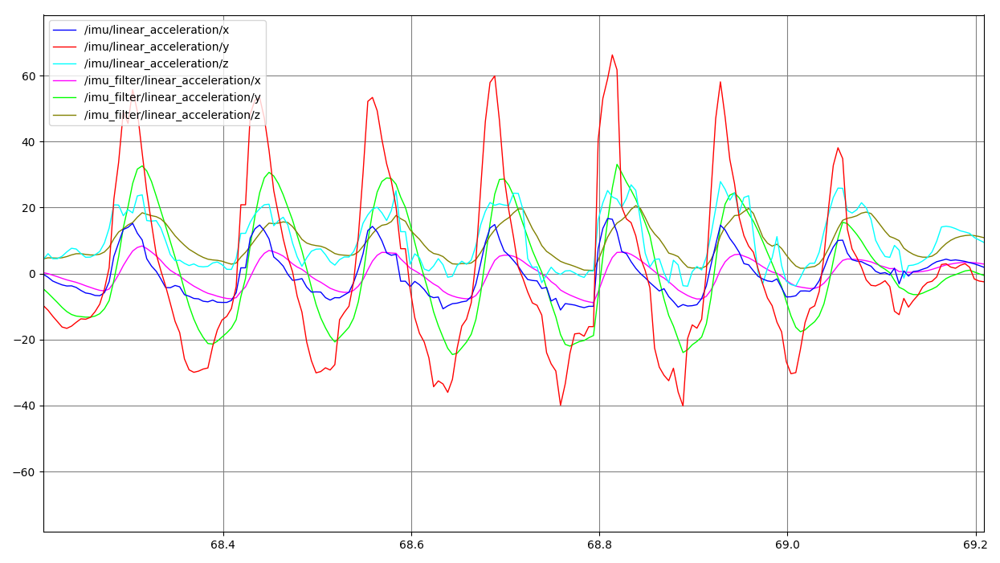

# sensor_imu

WeChangeTech USB/Uart IMU module ROS package

-----

<p align="center">
    
    </br>
    
</p>

## build & run

* udev (do only once)
  ```sh
  roscd sensor_imu/script/
  sudo ./udev.sh
  ```

* build
  ```sh
  catkin_make
  ```

* run
  ```sh
  # with `gravity:=false` can output none gravity imu data
  # (z,y,z line accel is zero when static or constant speed)
  roslaunch sensor_imu sensor_imu.launch [gravity:=false]
  ```

* plot
  ```sh
  rqt_plot /imu/linear_acceleration /imu_filter/linear_acceleration
  ```

  <p align="center">
      
  </p>
